# Docker Grafana Influx Nodered

Le script runDocker.sh permet de faciliter l'instanciation de la compostion docker.

### Prérequis:
- **docker** et **docker compose** doivent être installés (`apt install docker docker-compose`)
- L'utilisateur doit être dans les groupes **sudo** et **docker** (`usermod -aG sudo $USER && usermod -aG docker $USER`)
- Ce dossier doit se nommer ~/Docker

### Execution:
Une fois ces prérequis validés, exécuter le script runDocker.sh

Il demande de créer plusieurs comptes et mots de passes pour grafana et influx, puis demande d'executer la composition pour initier les comptes utilisateurs de nodered.

Une fois l'installation terminée il affiche un recapitulatif des conteneurs actifs.

Les Fichiers influxDB et nodered bindés aux conteneurs sont dans le dossier /data

#### Rappels pour docker:
- `docker ps` : liste les conteneurs actifs
- `docker rm $ID` : supprime le conteneur "$ID"
- `docker rm $(docker ps -aq)` : supprime tous les conteneurs

#### rappel pour docker-compose:
#### doit être exécuté depuis le dossier ou est le fichier docker compose (~/Docker)
- `docker-compose up -d` : lance les conteneurs de la composition
- `docker-compose down` : arrête les conteneurs
- `docker-compose logs -f ` : affiche les logs des conteneurs
- `docker-compose logs -f --tail=100 influxdb` : affiche les logs (avec 100 lignes d'historique) du conteneur nommé influxdb
- `docker-compose restart influxdb` : redémarre le conteneur nommé influxdb

## configuration
### initier la base de donnée
Depuis nodered **http://$IP:1880** se connecter avec le compte administrateur initié plus tot.

Depuis l'onglet **Save Data** cliquer sur un bloc en lien avec influxDB comme "CREATE DATABASE lorawan"

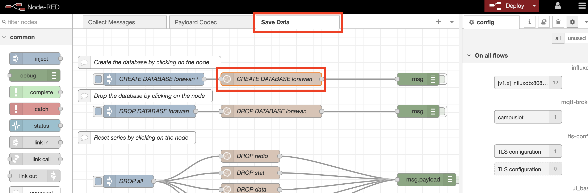

On peut voir ici le nom du conteneur et le port influxDB prérempli ainsi que la commade "create database" qui sera executée en cliquant sur le node.

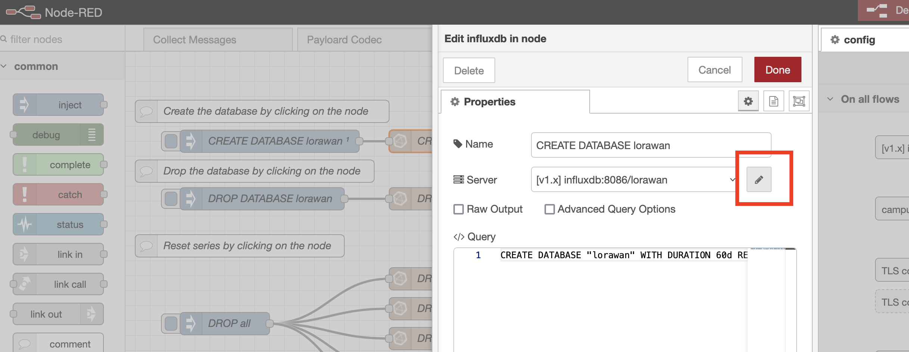

Cliquer sur le crayon à coté de ce nom pour renseigner les informations d'authentification à InfluxDB:

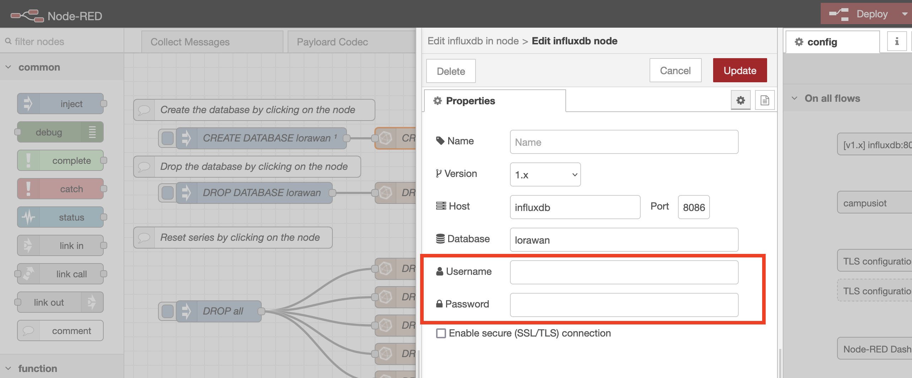

Ensuite on peut deployer ces modifs via le bouton "deploy" en haut à droite de nodered.

On va maintenant pouvoir créer la base de données via le node, ce bouton exécute la commande vu précedement dans le bloc suivant sur la même ligne.

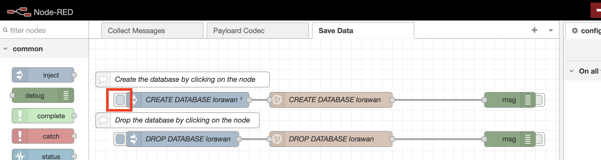

Il est possible de suivre les logs de influxDB avec la commande `docker-compose logs -f influxdb` sur le serveur pour confirmer la création de la base.

### initier la connexion mqtt avec CampusIOT
Toujours depuis nodered à l'onglet "Collect Messages"
Cliquer sur **Application RX**

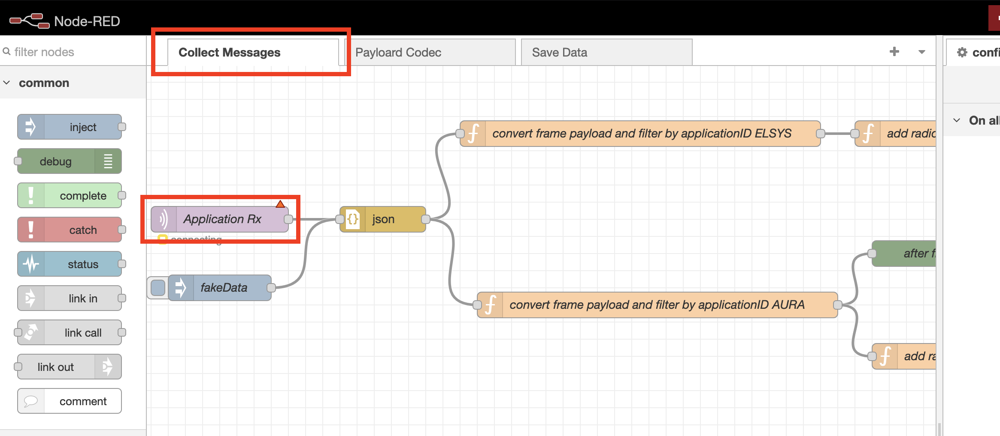

Puis sur le crayon proche du nom du serveur campusiot

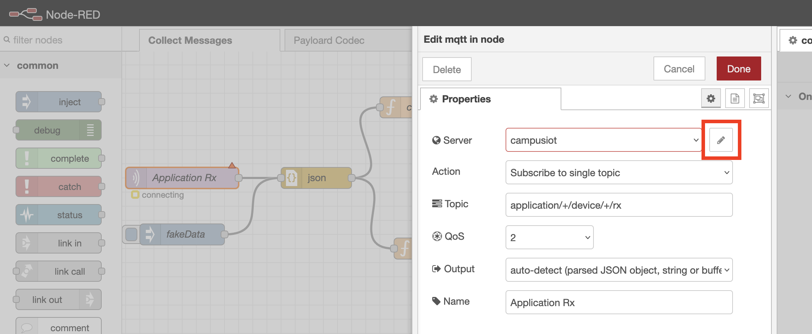

On peut ici changer le topic et le ca.crt pour la configuration SSL.

Le certificat peut se récupèrer avec la commande `wget https://raw.githubusercontent.com/CampusIoT/campusiot-certs/master/mqtt/ca.crt`

plus d'info ici : https://github.com/CampusIoT/tutorial/tree/master/nodered#etape-1-journaliser-le-flot-mqtt-de-messages-dans-un-fichier-avec-nodered

Il faut aussi renseigner les credentials MQTT fournis par campusIOT dans l'onglet security.

Ensuite 2 exemples de filtre par ApplicationID sont présents:
- convert frame payload and filter by applicationID ELSYS
- convert frame payload and filter by applicationID AURA

Ils peuvent etre modifiés pour correspondre au capteurs souhaités

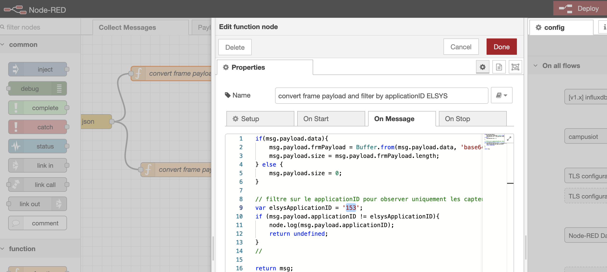

De la même maniere le formatage des données peut être modifié pour correspondre au schema souhaité, depuis l'onglet save data:

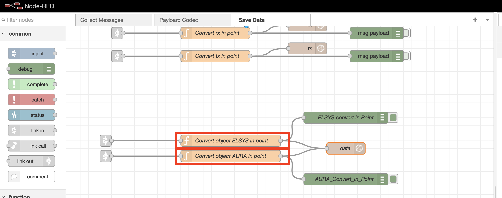

Une fois ces configurations déployées node red est pret à faire transiter les messages vers la base.

### Dashboard Grafana
### connexion à la base de données influxDB
Pour ajouter une base de données il faut aller dans l'onglet connections:

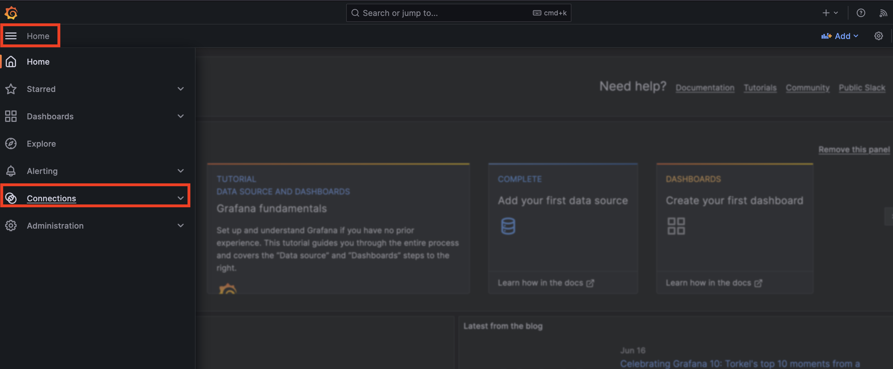

Puis chercher "influx"

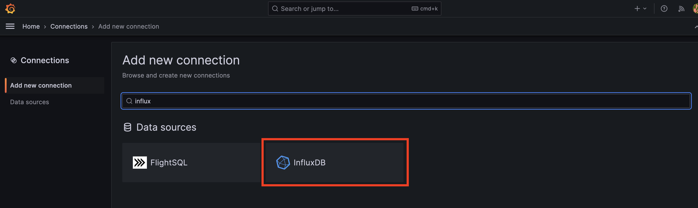

Et cliquer sur "create a influxDB data sources"

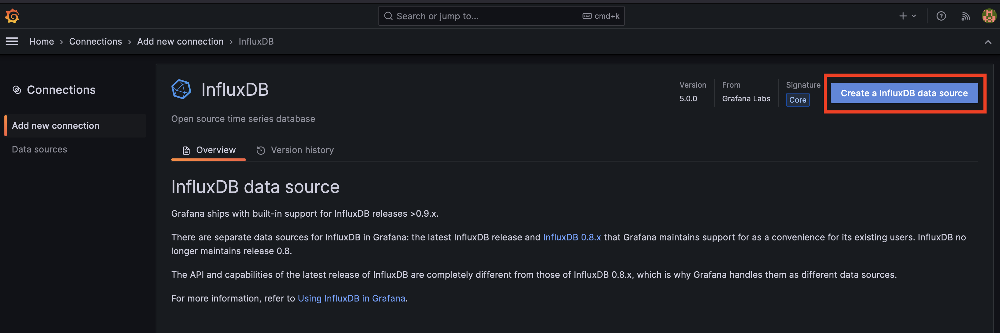

Renseigner les informations comme ci dessous:

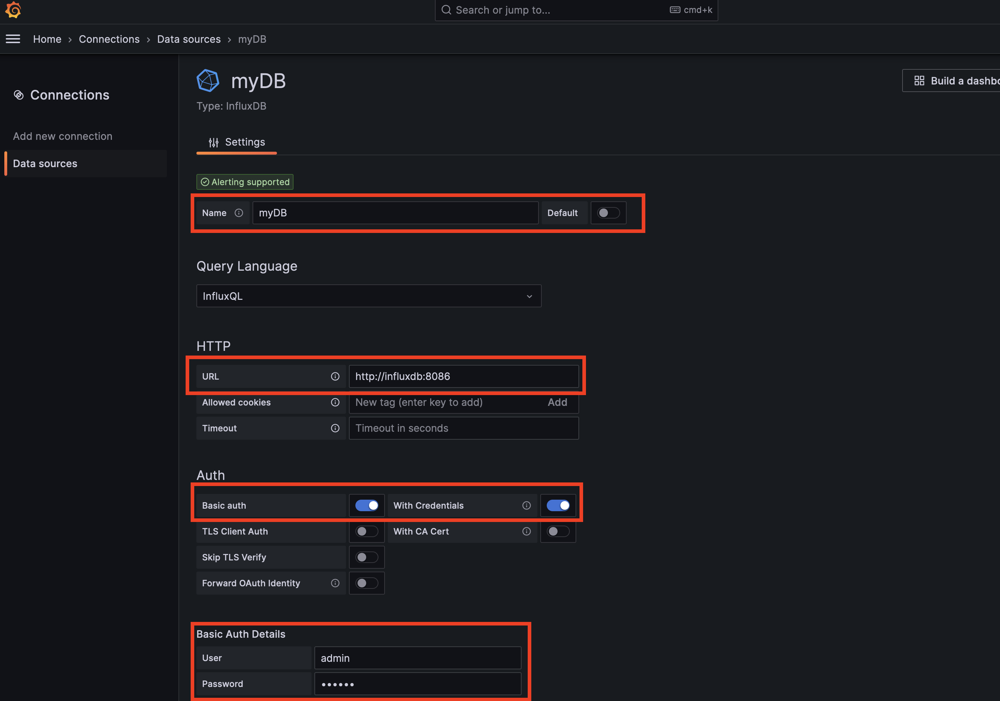
Dans l'URL veiller à renseigner "http://" puis "influxdb" (qui correspond au nom du conteneur) et le port d'influxdb : 8086

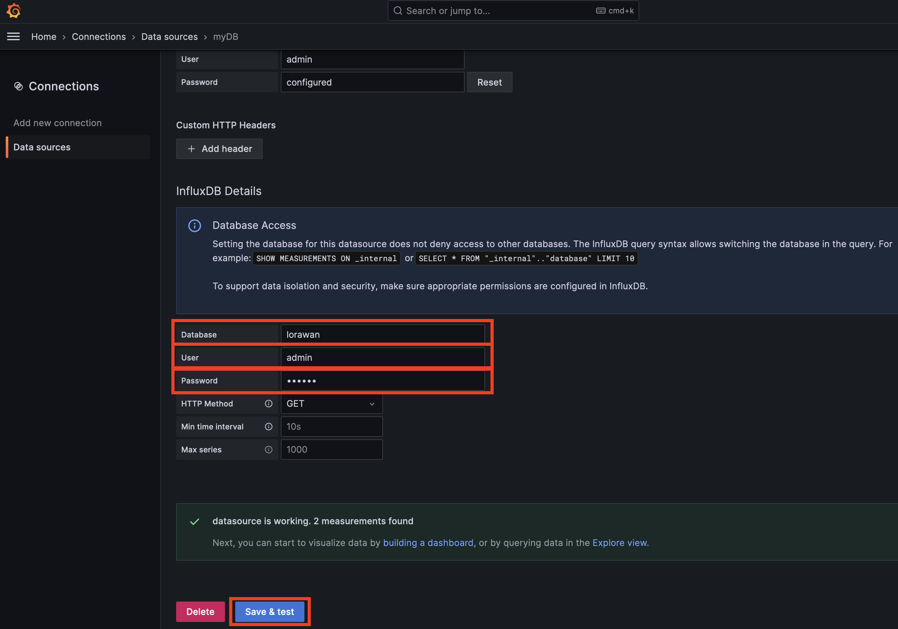

L'enregistrement de cette base effectue un test de connexion.

#### Création de graphique:
Il faut créer un "dashboard" qui contiendra un ou plusieurs graphiques:

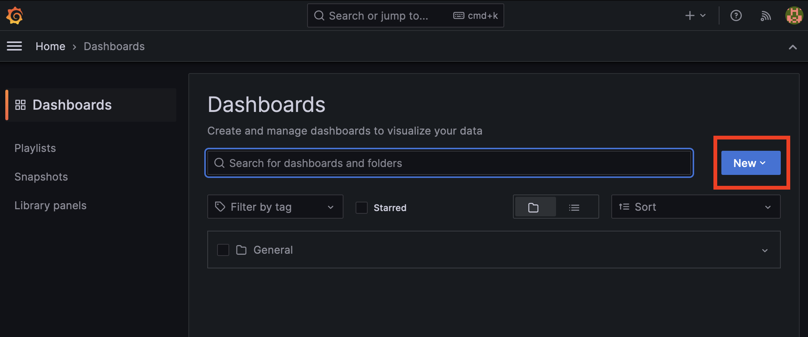

Puis créer une premiere "visualization":

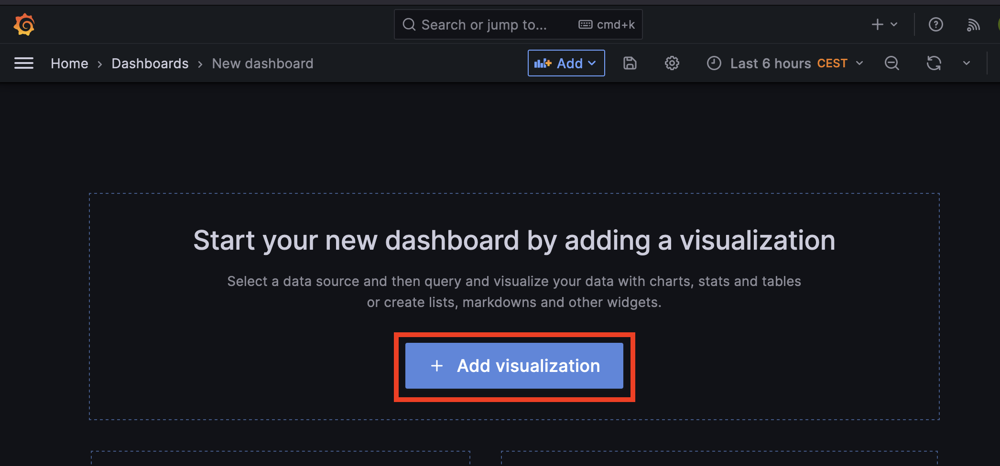

La page de création comporte 3 parties,le rendu visuel en haut à gauche, la ou les requêtes en bas à gauche et la mise en forme à droite

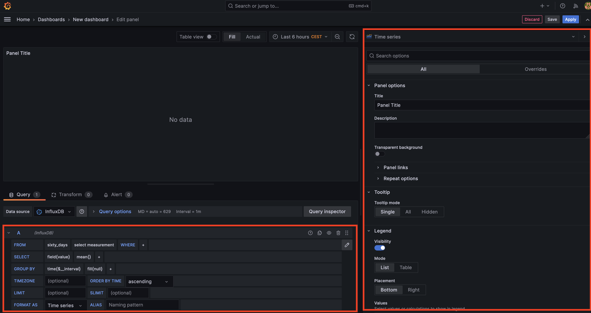

si le "query language" defini lors de connexion à la base est "influxQL" les requetes s'écrivent dans un langage proche de sql, et un outil graphique peut aider à les concevoir, en cliquant sur les cases les champs sont proposés

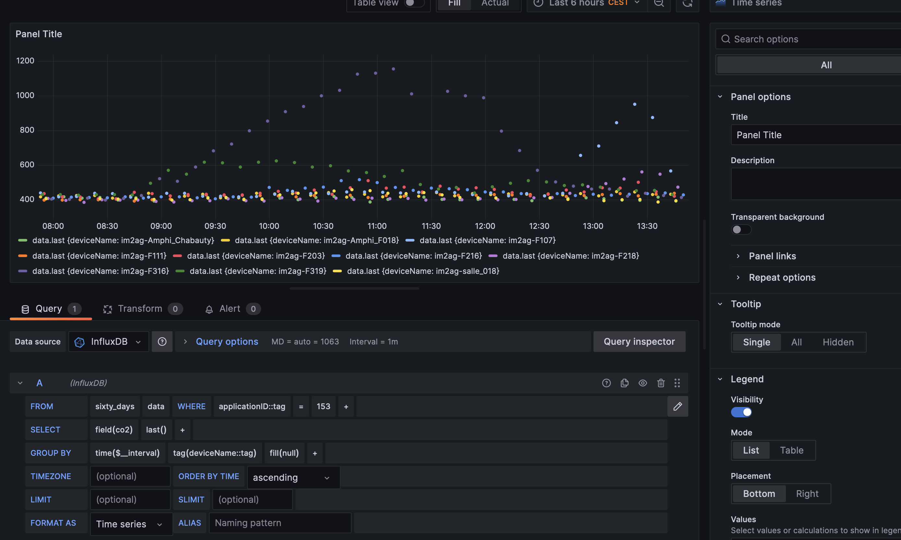

ce bouton permet de passer à la requête en format textuel:

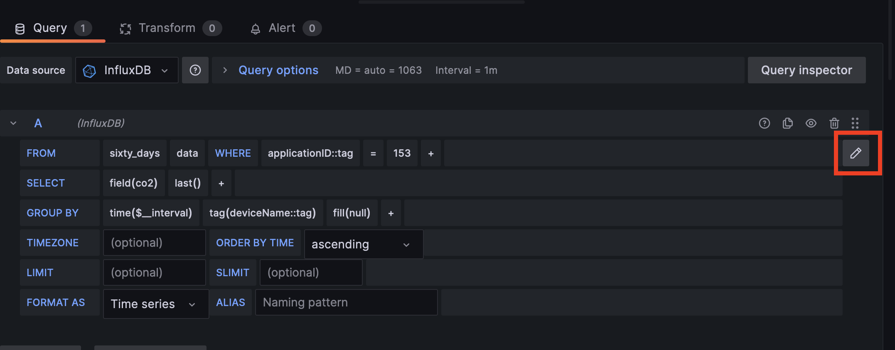

Pour plus de flexibilités dans les graphiques il est possible de créer des variables depuis une requetes, via les parametres du dashboard:
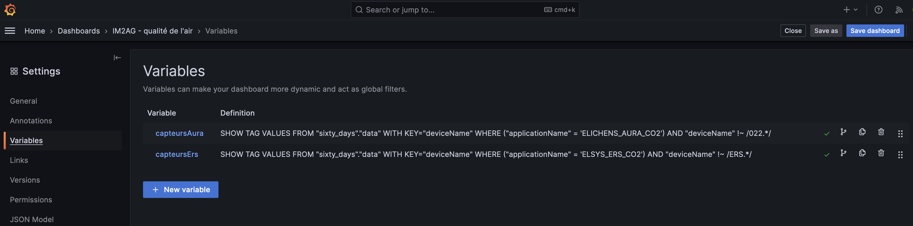

Elles pourront ensuite être utilisées pour automatiser les rendus de divers capteurs

Utilisation de variable: https://grafana.com/blog/2020/06/09/learn-grafana-how-to-automatically-repeat-rows-and-panels-in-dynamic-dashboards/

la documentation officielle est disponible ici https://grafana.com/docs/ 

