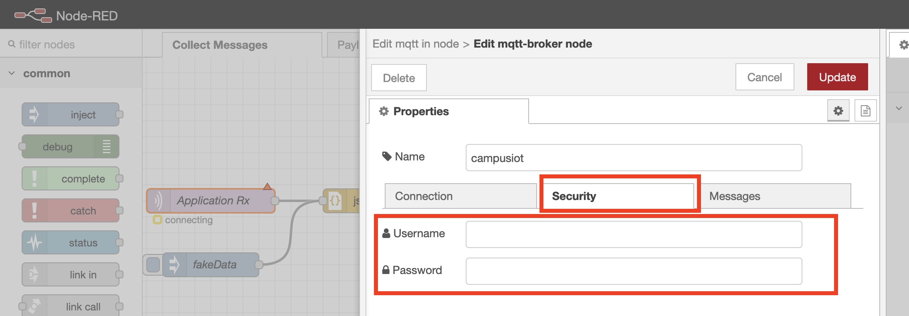

# Docker Grafana Influx Nodered

Le script runDocker.sh permet de faciliter l'instaciation de la compostion docker.

### Prérequis:
- docker et docker compose doivent être installés (`apt install docker docker-compose`)
- L'utilisateur doit être dans les groupes sudo et docker (`usermod -aG sudo $USER && usermod -aG docker $USER`)
- Ce dossier doit se nommer ~/Docker

### Execution:
Une fois ces prérequis validés, exécuter le script runDocker.sh
Il demande de créer plusieurs comptes et mots de passes pour grafana et influx, puis demande d'executer la composition pour initier les comptes utilisateurs de nodered.
Une fois l'installation terminée il affiche un recapitulatif des conteneurs actifs.

#### Rappels pour docker:
- `docker ps` : liste les conteneurs actifs
- `docker rm $ID` : supprime le conteneur "$ID"
- `docker rm $(docker ps -aq)` : supprime tous les conteneurs

#### rappel pour docker-compose:
#### doit être exécuté depuis le dossier ou est le fichier docker compose (~/Docker)
- `docker-compose up -d` : lance les conteneurs de la composition
- `docker-compose down` : arrête les conteneurs
- `docker-compose logs -f ` : affiche les logs des conteneurs
- `docker-compose logs -f --tail=100 influxdb` : affiche les logs (avec 100 lignes d'historique) du conteneur nommé influxdb
- `docker compose restart influxdb` : redémarre le conteneur nommé influxdb

## configuration
### initier la base de donnée
Depuis nodered http://$IP:1880
se connecter avec le compte administrateur initié plus tot
Depuis l'onglet Save Data cliquer sur un block en lien avec influxDB comme "CREATE DATABASE lorawan"

On peut voir ici le nom du conteneur et le port influxDB prérempli ainsi que la commade "create database" qui sera executé en cliquant sur le node.

Cliquer sur le crayon à coté de ce nom pour renseigner les informations d'authentification à InfluxDB:

Ensuite on peut deployer ces modifs via le bouton "deploy" en haut à droit de nodered

On va maintenant pouvoir créer la base de données via le node, ce bouton execute la commande vu précedement dans le block suivant sur la même ligne

Il est possible de suivre les logs de influxDB avec la commande `docker-compose logs -f influxdb` sur le serveur pour confirmer la création de la base

### initier la connexion mqtt avec CampusIOT
Toujours depuis nodered à l'onglet "Collect Messages"
Cliquer sur **Application RX**

Puis sur le crayon proche du nom du serveur campusiot

On peut ici changer le topic et le ca.crt pour la configuration SSL.
Le certificat se récupère au moyen de wget https://raw.githubusercontent.com/CampusIoT/campusiot-certs/master/mqtt/ca.crt

plus d'info ici : https://github.com/CampusIoT/tutorial/tree/master/nodered#etape-1-journaliser-le-flot-mqtt-de-messages-dans-un-fichier-avec-nodered

Il faut aussi renseigner les credentials MQTT fournis par campusIOT dans l'onglet security.

Ensuite 2 exemples de filtre par ApplicationID sont présents:
- convert frame payload and filter by applicationID ELSYS
- convert frame payload and filter by applicationID AURA

Ils peuvent etre modifiés pour correspondre au capteurs souhaités

De la même maniere le formatage des données peut être modifié pour correspondre au schema souhaité, depuis l'onglet save data:

Une fois ces configurations déployées node red est pret à faire transiter les messages vers la base.

### Dashboard Grafana
### connexion à la base de données influxDB
Pour ajouter une base de données il faut aller dans l'onglet connections:

Puis chercher "influx"

Et cliqeur sur create influx data sources

renseigner les informations comme ci dessous:

veiller à renseigner "http://" dans l'URL puis "influxdb" qui est le nom du conteneur et le port d'influxdb : 8086

l'enregistrement de cette base effectue un test de connexion.

Une fois valider on peut commencer à créer des dashboards:
